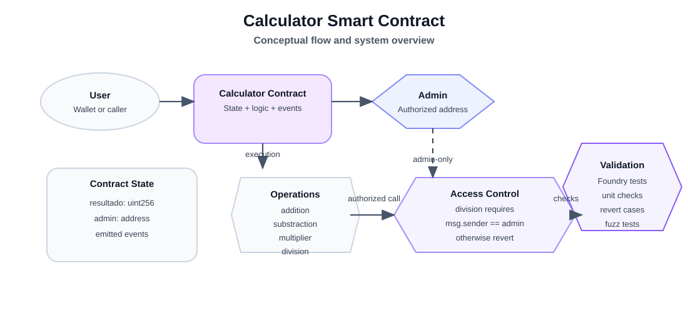

# Calculator Smart Contract

Smart contract for a basic arithmetic calculator built on Ethereum using Solidity and [Foundry](https://book.getfoundry.sh/). The project implements addition, subtraction, multiplication, and division operations, with division restricted to the administrator account through explicit access control. It also includes event emission for operation tracking and a Foundry-based test suite covering unit and fuzz testing scenarios.

## Overview

The contract maintains a public state variable named `resultado` and an administrator address named `admin`. It supports basic arithmetic operations including addition, subtraction, multiplication, and division.

Division is restricted to the contract administrator, while the remaining operations remain public. This pattern highlights access-control logic and security best practices in Solidity-based applications.

## Functionalities

The contract implements the following operations:

- `addition`: adds two numbers and stores the result
- `substraction`: subtracts two numbers and stores the result
- `multiplier`: multiplies two numbers and stores the result
- `division`: divides two numbers and stores the result, restricted to `admin`

## Contract details

| Function | Description | Access |
|---|---|---|
| `addition` | Adds two numbers and returns the result | Public |
| `substraction` | Subtracts two numbers and returns the result | Public |
| `multiplier` | Multiplies two numbers and returns the result | Public |
| `division` | Divides two numbers and returns the result | Admin only |

### Constructor

```solidity
constructor(uint256 firstResultado_, address admin_)
```

The constructor initializes:

- `resultado = firstResultado_`
- `admin = admin_`

This defines the initial state of the contract and the authorized address permitted to execute division.

## Access control

The division operation is protected by the following modifier:

```solidity
modifier onlyadmin() {
    require(msg.sender == admin, "Not allowed");
    _;
}
```

Any call to `division` from an unauthorized account triggers a revert with the message `Not allowed`.

## Events

Each operation emits an event containing the input values and the resulting output:

- `Addition`
- `Substraction`
- `Multiplier`
- `Division`

These events provide traceability and allow external consumers to monitor contract activity without directly reading the full state.

## Objectives

This project is intended to showcase the following engineering principles:

- Solidity state handling and contract design
- event-driven interaction patterns
- access control implementation
- error handling through reverts and validation logic
- automated testing with Foundry
- fuzz testing for edge-case validation

## Requirements

To run this project locally, the following tools are required:

- [Foundry](https://book.getfoundry.sh/)
- Git
- Node.js for optional tooling support

## Getting started

1. Clone the repository.
2. Navigate to the project directory.
3. Compile the project:

```bash
forge build
```

4. Run the test suite:

```bash
forge test
```

5. Format the Solidity files:

```bash
forge fmt
```

## Test coverage

The project includes automated tests covering:

- constructor initialization
- correct addition behavior
- correct subtraction behavior
- correct multiplication behavior
- multiplication overflow protection
- unauthorized division attempts
- authorized division execution
- division by zero handling
- fuzz testing with random inputs

## Concept map



## Current status

The contract is functional and the test suite passes successfully with Foundry. It provides a solid foundation for extending the project with more advanced smart contract patterns and production-ready logic.

## Current limitations

- Access control is currently applied only to division.
- Other arithmetic functions remain public by design.
- Division relies on Solidity’s native revert behavior for invalid and zero-value paths.

## Repository structure

```text
.
├── src/
│   └── Calculadora.sol
├── test/
│   └── CalculadoraTest.t.sol
├── README.md
├── foundry.toml
├── lib/
└── out/
```

## Useful resources

- [Foundry Book](https://book.getfoundry.sh/)
- [Solidity Documentation](https://docs.soliditylang.org/)

## License

MIT

## Author
Virginia Villela|Blockchain Developer
